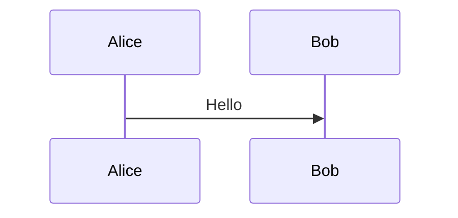

# Style Guide

> Документ бичих **бичлэгийн дүрэм** + stylistic conventions. Хэрэв
> reviewer "энэ стилийн зөрчилтэй" гэж зөвлөвөл энэ файлыг үзнэ.

## 1. Хэл

### 1.1 Үндсэн дүрэм

- **Контент** — монгол хэл (Cyrillic).
- **Нэр томъёо, кодын код** — англи хэл.
- **Зэрэгцээ хувилбар** — `<file>-en.md` суффиксаар.

### 1.2 Cyrillic vs Latin

| Зүйл | Хэл |
|---|---|
| Headings, body text | Cyrillic |
| Code blocks | Latin (English variable names) |
| Folder / file names | Latin (kebab-case) |
| API endpoint names | Latin (`/auth/initiate`) |
| Person names | Cyrillic (Б. Эрдэнэбат) |
| Place names | Cyrillic (Улаанбаатар) |
| Standard names | Latin (RFC 3647, ISO 27001) |
| URL | Latin |

### 1.3 Хэлбэрийн ялгаа

Бичих vs ярих хэв маяг — дунд зэрэг хатуу:

- ✅ "Сертификат олгох ажиллагаа..."
- ❌ "Cert-ийг issuing хийнэ..."  (англи hybrid биш)

## 2. Toned

- **Хариуцлагатай** — "should" биш "must" эсвэл "may".
- **Нарийн** — "shouldов" гэх мэт vague биш.
- **Pasиве хэрэгсэл** — "Гэрэгэ нь ХХ хийнэ" биш зүгээр "ХХ хийгдэнэ".
- **Жишээтэй** — теорийг concrete жишээгээр дэмжих.

### 2.1 Жишээ — сайн vs муу

❌ Муу:

> Бид магадгүй сертификатыг шууд revoke хийнэ.

✅ Сайн:

> Subscriber хүсэлт ирмэгц 24 цагийн дотор сертификатыг revoke хийнэ
> (CRL-ийн дараагийн refresh-ийн өмнө).

## 3. Heading

### 3.1 Hierarchy

- **# H1** — Документын title (frontmatter `title`-той ижил, эсвэл хасаж болно)
- **## H2** — Үндсэн section (1, 2, 3, ...)
- **### H3** — Sub-section
- **#### H4** — Sub-sub (хэрэглэхгүй бол сайн)
- **##### H5, H6** — Бараг хэрэглэхгүй

### 3.2 Дугаарлалт

```markdown
# 1. Танилцуулга
## 1.1 Хамрах хүрээ
### 1.1.1 In-scope
### 1.1.2 Out-of-scope
## 1.2 Тодорхойлолт
# 2. ...
```

### 3.3 Heading style

- Sentence case (capitalize first word only): `## Хууль зүйн нөхцөл`
  биш `## Хууль Зүйн Нөхцөл`.
- Period (.) хэрэглэхгүй: `## 1. Танилцуулга` биш `## 1. Танилцуулга.`.

## 4. Table

### 4.1 Format

```markdown
| Column 1 | Column 2 | Column 3 |
|---|---|---|
| value | value | value |
```

- Pipe `|` хооронд зайтай.
- `---` separator (хэдэн dash байх нь чухал биш).
- Column-ийн dash тоог equal болгох хэрэггүй (markdown зайлшгүй биш).

### 4.2 Том хүснэгтийн альтернатив

10+ row хүснэгт бол list эсвэл yaml-аар:

```markdown
- **Item 1**: тайлбар
- **Item 2**: тайлбар
- ...
```

### 4.3 Хүснэгтэн дотор код

```markdown
| Endpoint | Method |
|---|---|
| `/auth/initiate` | POST |
| `/auth/session/{id}` | GET |
```

## 5. Code block

### 5.1 Тэмдэглэх хэл

```markdown
```bash
echo "Hello"
```

```sql
SELECT * FROM users;
```

```yaml
key: value
```
```

Pandoc syntax-highlight `tango`-аар render. Mongolian text-ыг ч валид.

### 5.2 Inline code

```markdown
`variable`, `function()`, `/path/to/file`, `git status`
```

Кириллийн `файл нэр` хэрэглэхгүй — латин file/var name only.

## 6. List

### 6.1 Bullet

```markdown
- Item 1
- Item 2
  - Nested 1
  - Nested 2
- Item 3
```

2-space nesting.

### 6.2 Numbered

```markdown
1. Алхам 1
2. Алхам 2
   1. Sub-step a
   2. Sub-step b
3. Алхам 3
```

### 6.3 Definition list (pandoc-extra)

```markdown
Term 1
  : Definition.

Term 2
  : Another definition.
```

## 7. Холбоо

### 7.1 Inline

```markdown
[OpenAPI spec](../03-technical/api/backend-openapi.yaml)
```

Линк нэр нь meaningful — "click here" биш.

### 7.2 Reference

```markdown
[OpenAPI][openapi]

[openapi]: ../03-technical/api/backend-openapi.yaml
```

Файлын доод хэсэгт refers ашиглах боломжтой.

### 7.3 Anchor

```markdown
[§3.2 Subject Identity](#32-subject-identity)
```

Heading slug нь автомат — кирилл бол транслитер.

### 7.4 External

```markdown
[RFC 3647](https://datatracker.ietf.org/doc/html/rfc3647)
```

## 8. Image / diagram

### 8.1 Image

```markdown

```

Path нь репо relative.

### 8.2 Mermaid (preferred for diagrams)

````markdown

````

GitHub-аар auto render. Pandoc нь plain text-аар үлдээнэ — Word дотор raw
харагдана.

Гадуур render хэрэгтэй бол:

```bash
mmdc -i diagram.mmd -o diagram.svg
```

Тэгээд `.md`-д ``.

### 8.3 ASCII diagram

```markdown
```
┌─────────────┐
│  RP         │ → Backend → HSM
└─────────────┘
```
```

Жижиг inline diagram-д тохиромжтой.

## 9. Bold / italic / strikethrough

```markdown
**bold** — emphasis on important rule
*italic* — soft emphasis or terminology
~~strikethrough~~ — deprecated, removed
`code` — technical identifier
```

Хэт олон bold үг эмфазиа алддаг — sparingly хэрэглэ.

## 10. Blockquote

```markdown
> Quotation эсвэл important callout.
> Multi-line acceptable.
```

Pandoc-аар Word-ийн "Quote" style-аар render.

## 11. Horizontal rule

```markdown
---
```

Section break-аар хэрэглэ. Frontmatter delimiter биш — frontmatter дотор `---`
бол YAML key/value separator биш юм.

## 12. Footnote

```markdown
Текст[^1].

[^1]: Footnote text.
```

Long footnote бол block:

```markdown
[^longnote]: Хэдийгээр энэ бол тайлбар, олон мөртэй ч байж болно.

    Тус indent.
```

## 13. Comment / TODO

### 13.1 HTML comment (pandoc-аар хадгалагдана)

```markdown
<!-- TODO: review by 2026-Q3 -->
```

### 13.2 Tagged TODO

```markdown
> **TODO**: Migrate to v2 schema once HSM cluster ready.
```

### 13.3 Placeholder

`<<TBD: ...>>` гэдэг convention-ыг хэрэглэнэ:

```markdown
HSM model: `<<TBD: production HSM model>>`
```

`<<TBD>>` нь grep-ээр хайх боломжтой → outstanding бичлэгийг олж сольно.

## 14. Lengths

| Элемент | Recommended length |
|---|---|
| Document title | < 80 chars |
| H2/H3 heading | < 60 chars |
| Paragraph | 3-7 sentences |
| Code block | < 40 lines (longer → linked file) |
| Table row | < 8 columns |
| Document overall | 500-3000 words (typical); legal docs up to 10000 |

## 15. Frontmatter заавал

[FRONTMATTER.md](./FRONTMATTER.md) — гадна placeholder-ийг бөглөх.

## 16. Cross-link

Docs хооронд:

```markdown
[CP](../01-legal/certificate-policy.md)
[Section 4.5](../01-legal/certificate-policy.md#45-key-pair-ба-сертификат-ашиглалт)
[`internal/service/session.go`](../../eid-gerege-backend/internal/service/session.go)
```

## 17. Anti-patterns

❌ **Гарчигны ард цэг:** `## 1. Танилцуулга.` → ✅ `## 1. Танилцуулга`

❌ **Wall of text:** 30+ мөртэй параграф → 5-7 мөр-аар, эсвэл list/table-аар хуваах.

❌ **Verb chains:** "хийх ёстой бөгөөд хэрэглэгдэж болох..." → "хэрэглэнэ".

❌ **Mixed Cyrillic/Latin in identifier:** "Гэрэгэ-`auth`-handler" → "auth handler" (англи) эсвэл "auth-ийн handler" (mongolian connector).

❌ **Inconsistent capitalization:** "PKI" / "Pki" / "pki" → бүгд "PKI".

❌ **Past tense ажилаа:** "Тэс зурагдсан" → "Тэс зурагдана" (present-tense rules).

## 18. Хувилбарын түүх

| Хувилбар | Огноо | Өөрчлөлт |
|---|---|---|
| 1.0.0 | 2026-04-29 | Анхны guide |
